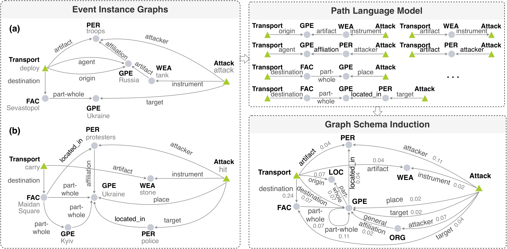

# Cross-media Structured Common Space for Multimedia Event Extraction

Table of Contents
=================
  * [Overview](#overview)
  * [Requirements](#requirements)
  * [Data](#data)
  * [Training](#training)
  * [Testing](#testing)
  * [Citation](#citation)

## Overview
The code for paper [Connecting the Dots: Event Graph Schema Induction with Path Language Modeling](http://blender.cs.illinois.edu/software/pathlm/).

<p align="center">
  
</p>

## Requirements

```
Python=3.7
PyTorch=1.4
```

## Data

ACE (Text Event Extraction Data): We preprcoessed ACE following [OneIE](http://blender.cs.illinois.edu/software/oneie/). Due to license reason, the ACE 2005 dataset is only accessible to those with LDC2006T06 license, please drop me an email (manling2@illinois.edu) showing your possession of the license for the processed data.

## Training

Step 1. Prepare ACE data. Put the preprocessed ACE data under `data/ace`. The example of preprocessed ACE data is `example.json`in `Data.zip`. 

Step 2. Generate paths.

```
cd data_utils/preprocessing/ace
python path_discover.py
```
Step 3. Generate training data for autoregressive language model and neighbor path classfication.

```
cd data_utils/preprocessing/ace
python path_tsv_vocab.py
``` 

Step 4. Train PathLM on two tasks,

```
sh path_xlnet_ft.sh
```
The variant of PathLM removing neighbor path classification can be trained as follows,

```
sh path_xlnet_ft_clm.sh
```

## Testing

```
cd data_utils/preprocessing/ace
python evaluate_path.py
```

## Citation

Manling Li, Qi Zeng, Ying Lin, Kyunghyun Cho, Heng Ji, Jonathan May, Nathanael Chambers, Clare Voss. "Connecting the Dots: Event Graph Schema Induction with Path Language Modeling." In Proceedings of the 2020 Conference on Empirical Methods in Natural Language Processing (EMNLP), pp. 684-695. 2020.
```
@inproceedings{li2020connecting,
  title={Connecting the Dots: Event Graph Schema Induction with Path Language Modeling},
  author={Li, Manling and Zeng, Qi and Lin, Ying and Cho, Kyunghyun and Ji, Heng and May, Jonathan and Chambers, Nathanael and Voss, Clare},
  booktitle={Proceedings of the 2020 Conference on Empirical Methods in Natural Language Processing (EMNLP)},
  pages={684--695},
  year={2020}
}
```